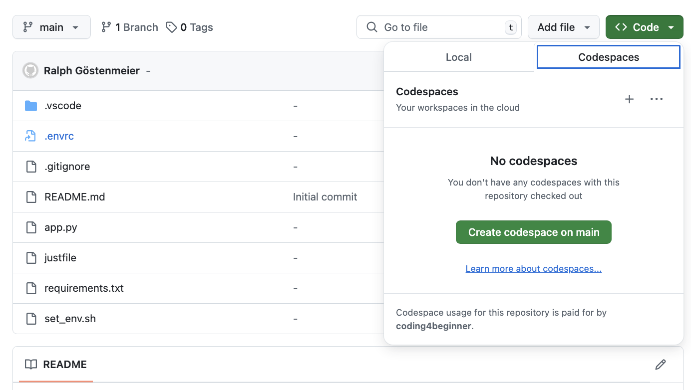
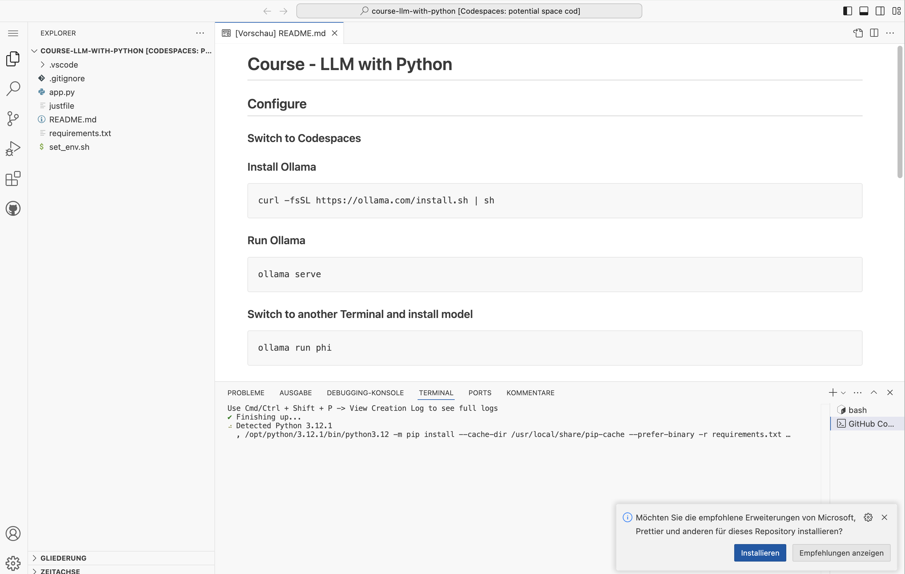
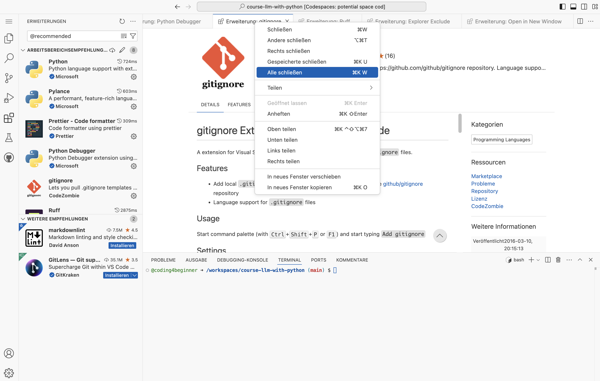
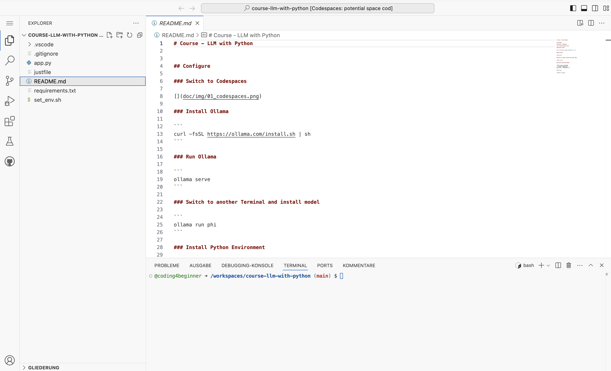
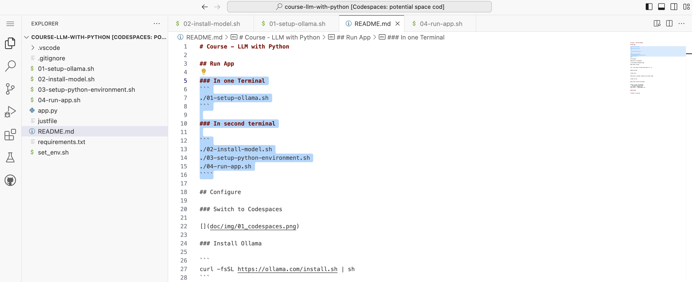
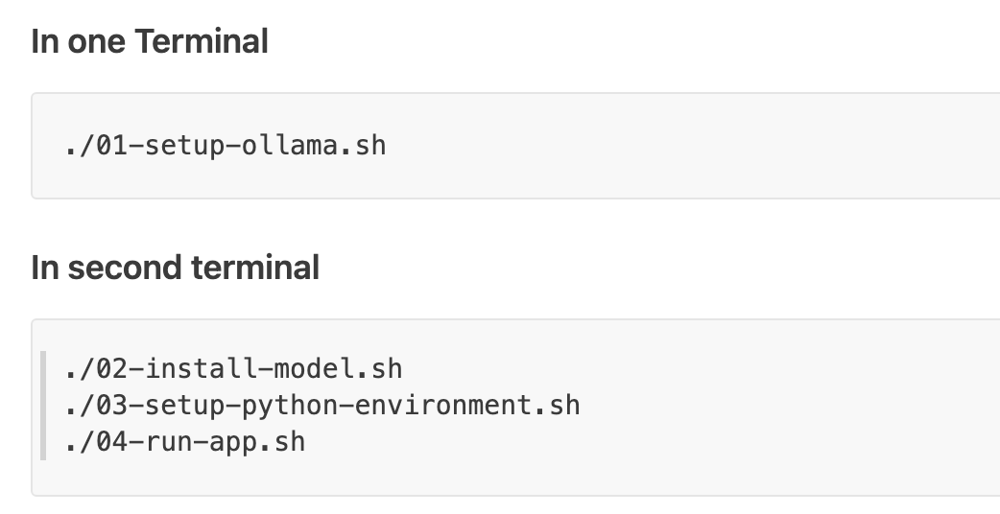
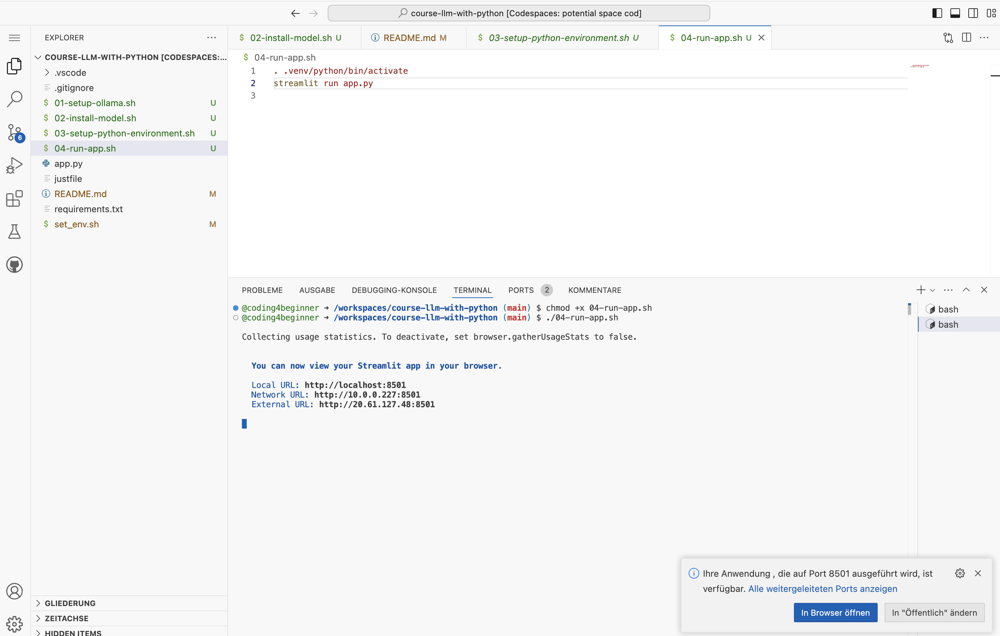
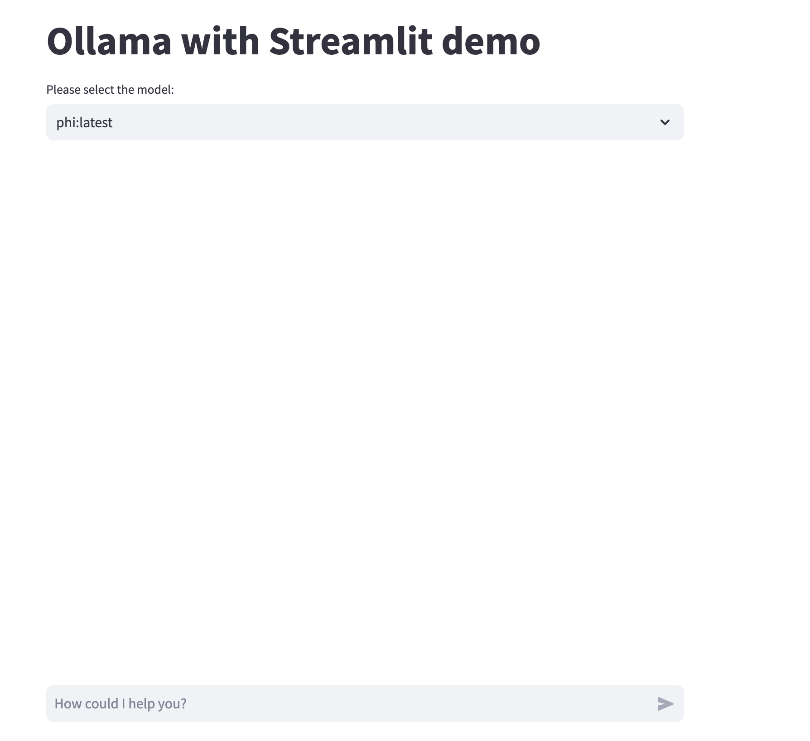

# Course - LLM with Python

## Run App

### In one Terminal

```
./bin/01-setup-ollama.sh
```

### In second terminal

```
./bin/02-install-model.sh
./bin/03-setup-python-environment.sh
./bin/04-run-app.sh
```

## Configure

| What to do                     | Screenshot                                                                   |
| ------------------------------ | ---------------------------------------------------------------------------- |
| Create new Codespace           |                   |
| Install extensions             |           |
| Close all extension windows    |  |
| Select README to show commands |                       |
| Run commands                   |    
| Commands                   |    
| Open app in Browser            |          |
| Run Streamlit                  |                |

### Install Ollama

```
curl -fsSL https://ollama.com/install.sh | sh
```

### Run Ollama

```
ollama serve
```

### Switch to another Terminal and install model

```
ollama run phi
```

### Install Python Environment

````
python -m venv .venv/python
. .venv/python/bin/activate
pip install --upgrade pip
pip install -r requirements.txt
```

### Run App

```
streamlit run app.py
```
````
